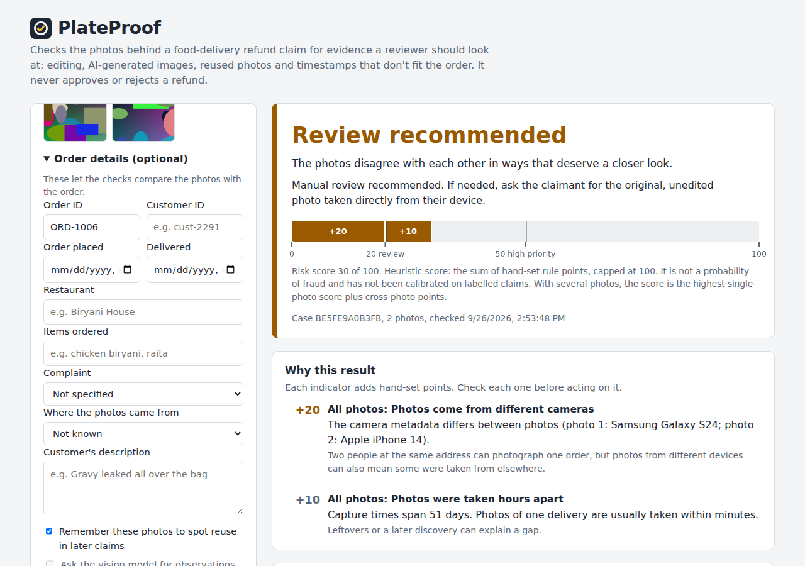
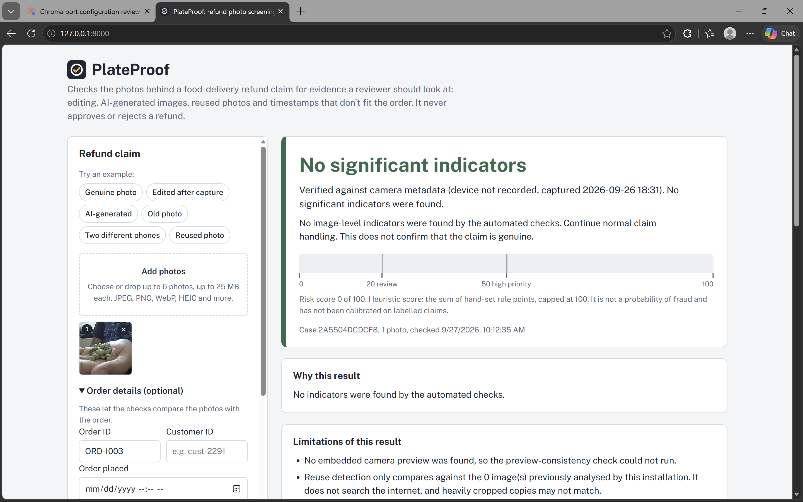
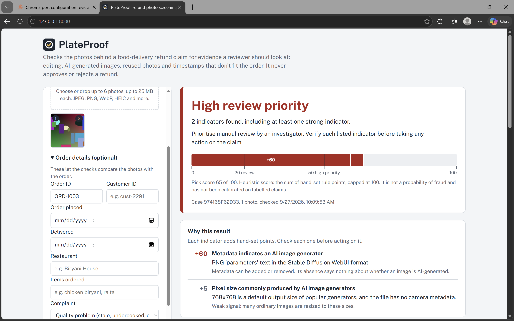

# PlateProof

Screens the photos behind a **food-delivery refund claim** for image-level
evidence that a human reviewer should look at: edits made after the photo was
taken, AI-generator metadata, photos reused across orders, and camera
timestamps that don't fit the order.

It does **not** decide whether a claim is fraudulent, and it never approves or
rejects a refund. It produces a list of evidence, a review level, an
explanation of why, and what could not be checked.




### What PlateProof showed

Real iPhone photo:



AI-generated image:



## Why this exists

Refund fraud with edited or AI-generated food photos (added hair or insects,
"undercooked" meat, melted cakes) has been reported against delivery platforms
in several countries. Reviewers see many claims a day and little time per photo.
PlateProof surfaces the specific, checkable facts about each photo so that
review time goes where it matters, without treating honest customers as
suspects.

## What it checks

| Check | What it looks for | Counts toward the score? |
|---|---|---|
| Upload validation | Real image type (by content, not name), size and pixel limits, corrupt files; EXIF rotation; any colour mode | Mismatched extension (weak) |
| Metadata and provenance | EXIF camera data, timestamps, editing software; AI-generator signatures in PNG text, XMP and Content Credentials (C2PA) | Yes |
| Order timing | Camera time vs order-placed and delivered times, with clock tolerances and time-zone alignment | Yes |
| Embedded-preview consistency | Cameras store a small preview inside a JPEG; editors often change the photo but keep the old preview | Yes |
| Reuse detection | Exact (SHA-256) and near-duplicate (perceptual hash, incl. mirrored) matches against earlier submissions, aware of order and customer | Yes |
| Cross-photo checks | In multi-photo claims: different phones, capture times hours apart | Yes |
| Compression, screenshot and generator sizes | Context about where the file came from | Weak / no |
| Error level analysis | A visual aid for the reviewer | Never |
| Vision model (optional, Gemini) | Items and problem visible, visible text such as an order sticker, photo-of-a-screen, consistency with the complaint | Never (advisory) |
| Experimental classifier (optional) | An AI-image classifier you can train yourself | Never (advisory) |

Missing metadata is treated as **context, not evidence**. Delivery apps,
messaging apps and screenshots remove it routinely. When a photo has too little
information to check, the result is `INSUFFICIENT_EVIDENCE` rather than a
misleading "low risk".

## Review levels and the score

| Level | Meaning |
|---|---|
| `HIGH_REVIEW_PRIORITY` | At least one strong indicator, or indicators adding up to 50+ |
| `REVIEW_RECOMMENDED` | At least one moderate indicator, or 20+ points |
| `NO_SIGNIFICANT_INDICATORS` | The photos had verifiable metadata and nothing significant was found |
| `INSUFFICIENT_EVIDENCE` | Nothing found, but the photos lacked the information needed to check |

The **risk score** (0-100) is the sum of hand-set points, all defined in one
table in [`app/risk_engine.py`](app/risk_engine.py):

| Indicator | Severity | Points |
|---|---|---:|
| File metadata names an AI image generator | high | 60 |
| Identical file already submitted for a different order | high | 50 |
| Camera timestamp is earlier than the order itself | high | 50 |
| Near-identical image submitted for a different order | high | 40 |
| Camera timestamp is earlier than the delivery | high | 40 |
| Identical file seen before; order linkage unknown | medium | 30 |
| Embedded camera preview differs from the main image | medium | 30 |
| Near-identical image seen before; order linkage unknown | medium | 25 |
| Main image cropped or reshaped after the preview was created | medium | 20 |
| Last saved by image-editing software | medium | 20 |
| Camera timestamp lies in the future | medium | 20 |
| Photos in one claim come from different cameras | medium | 20 |
| Photo taken more than 6 hours after delivery | low | 10 |
| File modified well after it was captured | low | 10 |
| Photos in one claim were taken hours apart | low | 10 |
| Described as a camera original but has no camera metadata | low | 10 |
| File extension or declared type doesn't match the content | low | 5 |
| Pixel size typical of AI generators, with no camera metadata | low | 5 |

These are **heuristics**. The score is not a probability of fraud and has not
been calibrated on labelled claims. For a claim with several photos, the score
is the highest single-photo score plus the cross-photo points; photo scores
are not summed, so sending more photos is not penalised. Model and LLM output
never contributes.

## Architecture

```
Browser UI (static/)  ──►  POST /api/analyze  (FastAPI, app/main.py)
                                  │  1-6 photos + optional order details
                        for each photo (app/pipeline.py):
                          validate & decode once (app/validation.py)
        ┌──────────┬──────────┬───────────┬────────────┬─────────────┬──────────┐
    properties  metadata  integrity  duplicates   ml_detector    vision
                + order    (preview,  (SQLite     (optional)    (optional,
                timing      ELA)      history)                  in parallel)
        └──────────┴──────────┴───────────┴────────────┴─────────────┴──────────┘
                     each check: own timeout, failure isolated
                                  │
                   cross-photo checks (app/checks/claim.py)
                                  │
                   rule-based risk engine (app/risk_engine.py)
                                  │
             claim report: level, score, evidence, limitations, per-photo detail
```

Checks report what they observed and never assign points; the risk engine is
the only place that decides how much an observation counts. If a check fails
or times out, the report says so and the rest of the analysis completes.

**Technologies:** Python 3.10+, FastAPI, Pillow (+ pillow-heif for iPhone HEIC),
NumPy (perceptual hashes), SQLite (reuse history), plain HTML/CSS/JS.
Optional: `google-genai` (Gemini), PyTorch (classifier), `huggingface_hub`
(evaluation data).

## Install and run

Requires Python 3.10 or newer.

```bash
git clone https://github.com/<your-username>/plateproof.git
cd plateproof
python -m venv .venv
# Windows:      .venv\Scripts\python.exe -m pip install -r requirements.txt
# macOS/Linux:  .venv/bin/pip install -r requirements.txt
# then start it:
# Windows:      .venv\Scripts\python.exe -m app
# macOS/Linux:  .venv/bin/python -m app
```

Open http://127.0.0.1:8000 and click one of the **Try an example** buttons.
No API keys are needed.

To use it from a phone on the same (trusted) network, start it with the
environment variable `HOST=0.0.0.0`; it then prints the address to open.
There is no login, so don't do this on public or shared Wi-Fi.

Docker alternative: `docker compose up --build`, then open http://localhost:8000.

## Configuration (all optional)

Copy `.env.example` to `.env` only if you want to change something.

| Variable | Default | Purpose |
|---|---|---|
| `GEMINI_API_KEY` | empty | Enables advisory vision-model observations |
| `GEMINI_MODEL` | `gemini-3.8-flash` | Gemini model name |
| `MAX_UPLOAD_MB` | `25` | Size limit per photo |
| `MAX_MEGAPIXELS` | `80` | Pixel limit per photo (protects memory) |
| `DATA_DIR` | `data/` | Where the reuse-history database lives |
| `HOST` / `PORT` | `127.0.0.1` / `8000` | Server address |

With the vision model enabled, a reduced copy of each photo is sent to Google.
It can be turned off per claim in the UI.

## API

`POST /api/analyze` (multipart form). Every field except the photos is optional.

| Field | Notes |
|---|---|
| `images` | 1 to 6 photos (repeat the field). `image` also works for one photo. |
| `order_id`, `customer_id` | Let reuse detection tell a resubmission from reuse on another order or account |
| `order_placed_at`, `delivered_at` | ISO 8601, e.g. `2026-05-02T19:30` or `2026-05-02T14:00Z` |
| `restaurant`, `ordered_items`, `description` | Used by the optional vision model |
| `complaint_type` | `missing_item`, `spilled_or_damaged`, `wrong_item`, `quality_issue`, `foreign_object`, `other` |
| `image_source` | `original_camera`, `messaging_app`, `social_media`, `email`, `screenshot`, `other` |
| `save_to_history`, `use_vision` | Default `true` |

```bash
curl -F images=@samples/5_taken_before_order.jpg -F order_placed_at=2026-05-02T19:00 \
     http://127.0.0.1:8000/api/analyze
```

The response is a claim report with an overall `risk`, cross-photo
`claim_evidence`, per-photo `photos[]` (evidence, checks, metadata, hashes),
`rejected` photos and `limitations`. Errors are JSON, e.g.
`{"error": {"code": "corrupt_image", "message": "..."}}`. Interactive docs are
at `/docs`.

## Tests

```bash
pip install -r requirements-dev.txt
python -m pytest
```

About 200 tests cover every supported image format and colour mode, each check
(including false-positive cases such as missing EXIF, missing GPS and phone
firmware versions), delivery-window rules with time zones, multi-photo claims,
the risk engine, API errors, vision-model failures (mocked), the optional
classifier's class-order handling, the evaluation script, and the documented
result of every sample image.

## Measuring it

`scripts/evaluate.py` runs labelled images through the real pipeline and writes
a report to `reports/` with per-group flag rates and 95% confidence ranges,
recall, false-flag rate, precision, which rules fired, and every misjudged file.

```bash
python scripts/evaluate.py --fraudbench          # FraudBench food subset (downloads ~1.5 GB once)
python scripts/evaluate.py --data eval_data/mine # your own photos + labels.csv
```

**FraudBench** (Yan et al., 2026, CC BY-NC-SA 4.0) is a research benchmark of
real and AI-edited refund evidence, including a food-delivery category from
GrabFood. Its photos come from review platforms, so they carry little or no
camera metadata; expect PlateProof to report most of them as
`INSUFFICIENT_EVIDENCE`. That result measures, honestly, the gap that metadata
forensics cannot close and that a trained detector would be needed for.
The images are downloaded to `eval_data/` (git-ignored) and must not be
redistributed. Dataset: https://huggingface.co/datasets/TristanYan/FraudBench

No accuracy figure is claimed here until such a report has been produced.

### Where the built-in thresholds come from

- **Embedded-preview check:** `scripts/calibrate_thumbnail_check.py` measures
  genuine and edited synthetic images; in that run no genuine image exceeded the
  threshold while about 92% of 2% pasted regions and all crops were flagged.
  Synthetic images are a stand-in: re-run it with real camera photos.
- **Near-duplicate matching:** recompressed, resized, brightened and lightly
  cropped copies stayed within pHash 12 / dHash 9, while the closest pair of
  different synthetic images was pHash 16 / dHash 12. Both hashes must match.
- **Order timing:** 5-minute tolerance before the order, 15 minutes before the
  recorded delivery, 6 hours after delivery. Chosen by judgement, not data.
- **Points and level thresholds:** hand-set, in `app/risk_engine.py`.

## Limitations

- An image cannot prove or disprove fraud. Edited photos can be legitimate, and
  fraudulent claims can use genuine, unedited photos that no image check catches.
- **Photos of a screen (recapture) are not detected.** Photographing an AI image
  on a monitor produces a genuine camera photo with genuine metadata. The
  optional vision model may notice a screen, but only as an advisory note. The
  practical defence is in-app capture, not image analysis.
- AI edits from tools that strip metadata are usually not detected; research
  (e.g. FraudBench) shows current detectors are unreliable here too.
- Metadata can be removed or forged; its presence is informative, its absence
  is not evidence of anything.
- Reuse detection only covers photos previously analysed by this installation.
  It does not search the internet, and heavily cropped copies may not match.
- The embedded-preview check only runs on camera JPEGs that still contain a
  preview (not HEIC), and its threshold was tuned on synthetic images.
- C2PA manifests are detected but their signatures are not verified.
- This is a prototype: no authentication or rate limiting. Do not expose it to
  the internet as is.

## Future work

- Run the evaluation on FraudBench and on a set of real phone photos, then
  calibrate points and thresholds from the results.
- Train and evaluate an AI-edit detector on food photos before letting it score
  (see `ml/README.md`).
- Verify C2PA signatures with the official `c2pa` library.
- Recapture (photo-of-screen) detection, validated on labelled examples.
- For production: in-app capture with a challenge (e.g. an on-screen code or the
  order sticker in frame), an indexed duplicate search for millions of photos,
  authentication, an audit log and an appeals flow.
